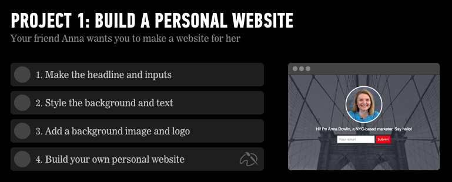
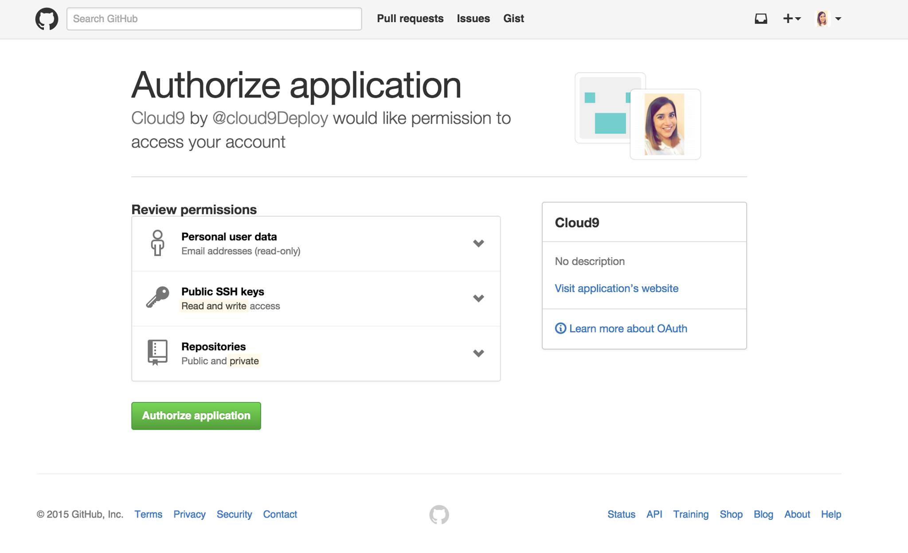
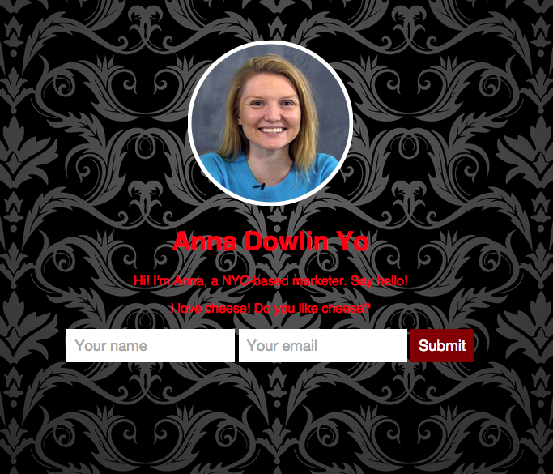
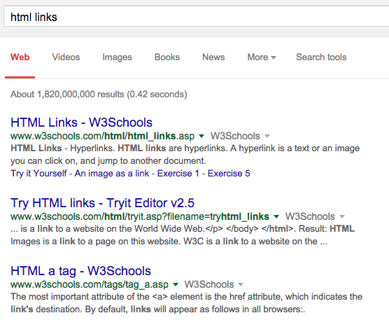
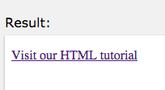
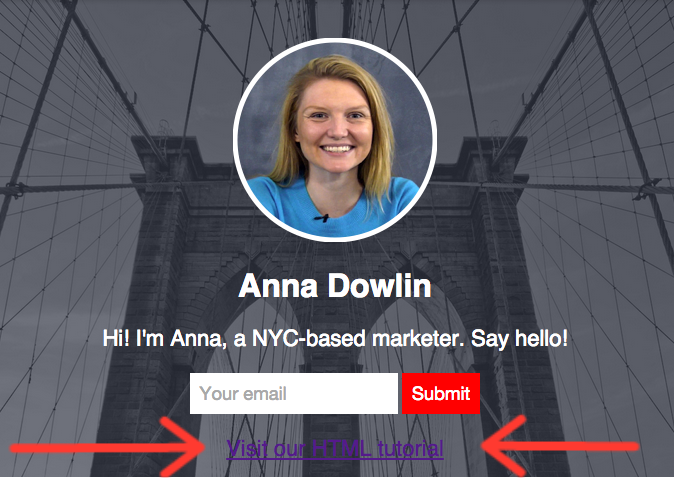

# Building Your First Website

In this tutorial, you will be learning how to build your first website!

There are two parts of this tutorial:

In part 1, we'll be using the website [Dash](https://dash.generalassemb.ly) to learn the
fundamentals of building a website.

Then in part 2, we'll be making our website using a tool called [Cloud9](https://c9.io).
Think of Cloud9 as the Microsoft Word for code.

## Requirements

Make sure you're running Google Chrome. If not, please [download and install it from
here](https://www.google.com/chrome/browser/desktop/).

Please use Google Chrome for any of these tutorials. Why?

- because Google Chrome is designed well for programmers
- some things just work in Google Chrome that don't work in other browsers.

## Part 1: Dash

### Signing up

Let's signup for Dash by registering [here](https://accounts.generalassemb.ly/users/sign_up)

### Doing project 1



Go ahead and complete the first three sections of Project 1:

- "Make the headline and inputs"
- "Style the background and text"
- "Add a background image and logo"
- [SKIP] Build your own personal website

## Part 2: Cloud9

You should have finished making your first webpage in Dash.

It should look something like this:


And the HTML code should look something like this:

```html
<!DOCTYPE html>
<head>
  <style>
    body {
      text-align: center;
      font-family: helvetica;
      background: url("http://dash.ga.co/assets/anna-bg.png");
      background-size: cover;
      background-position: center;
      color: white;
    }

    p {
      font-size: 22px;
    }

    input {
      border: 0;
      padding: 10px;
      font-size: 18px;
    }

    input[type="submit"] {
      background-color: red;
      color: white;
    }
  </style>
  <title>Anna Dowlin</title>
</head>
<body>
  
  <h1>Anna Dowlin</h1>
  <p>Hi! I'm Anna, a NYC-based marketer. Say hello!</p>
  <input type="email" placeholder="Your email">
  <input type="submit">
</body>
```

### Changing one thing

In your HTML code, replace

```html

```

with

```html

```

### Objectives of this next section:

Dash is a great environment for learning how to code in, but it isn't designed
for you to build real coding projects in. Cloud9 is.

Next we're going to

- learn how to setup and use Cloud9 by moving our code from
Dash to Cloud0.
- learn how to teach yourself new concepts in coding by using Google.

# Setting up your tools

Just like you may write your English essays in Microsoft Word, we will write
Code in Cloud9.

After you write your English essay, sometimes you save and share it on the
internet with tools such as Dropbox. The place where many professional developers save
and share their code is on a website called GitHub.com.

In the following steps, we will be setting up your own GitHub and Cloud9
accounts.

## Open [`github.com`](https://github.com)

GitHub lets you collaborate on writing code online.


## Create an account with a valid email


## Click "Sign up for GitHub"


## Validating your Email Address

- Check your email inbox for a confirmation email from github
- Make sure you click on the link it tells you to to confirm your account.

> *Important Note*: If you don't do this now, the latter part of this tutorial will not work for you!

## Open [`c9.io`](https://c9.io)

Cloud9 is like the Microsoft Office for writing code.

> 

# Click "SIGN UP"

> 

## Click "GitHub"

> 

## Sign In with GitHub

> 

## Authorize GitHub

> 

## Click on the "+" button

This creates a new Cloud9 workspace.

> 

## Set the workspace name to `hack-camp`

> 

## Click "Custom"

> 

## Click "Create Workspace"

> 

## Click on the Welcome Screen

> 

## Scroll Down

> 

## Update the settings

- Change `Soft Tabs` to `2`
- Enable `Auto-Save`

> 

## The Terminal

When we talk about the terminal, this is what we are referring to.

This is were we can run commands on the computer.

> 

## Start the Server

You've heard about a server is before but might not be sure what it is.

A server, similar to how a server in a restaurant serves you food, the
server on a computer "serves" the HTML page from Cloud9 and gives it back to
your browser.

Talk to your teaching assistants if you want to know more about what the server
does.

- Paste the following command into the terminal

  ```
  curl -sL https://git.io/vtbp6 | sudo dd of=/usr/local/bin/live_reload && sudo chmod +x /usr/local/bin/live_reload && live_reload
  ```

- hit `enter`.

- this may take a few minutes to finish.

## In the mean time, close the Welcome Tab

> 

## Finished setting up your workspace!

Great, now you've finished setting up your Cloud9 workspace!

The next step is to create the folders and files for your website.

## Creating your project files

### Creating the project folder

For each project that we work on, we want to create a new folder for it.

We are creating a new portfolio website so lets make a new folder for our
project named `portfolio`

- On the left file pane, right click and click `New Folder` to create a new
folder.
- Name it `portfolio`.

> 

### Creating our `index.html`

- right click on the `portfolio` folder
- click `New File`
- name it `index.html`
- double click it to open it

> 

### Moving your code from Dash

- Open the `index.html` file
- Paste in the code that you wrote in Dash inside of it

### Previewing our work

Great! Now let's see if everything is setup properly by viewing the page
we created in Cloud9.

- Click the `Preview` menu on the top bar
- then click `Preview Running Application`
- then click `portfolio`

> 

You should see the same result that you saw in Dash:

> 

### We can also open the website in its own tab.

- click the white arrow button
- and a new tab will pop up
- click on `portfolio`

> 

### Go ahead and close the tab inside the Cloud9 window

## Challenge: Mess around with the webpage in a way that you see fit

Here are some things that you can try:

- add another paragraph
- change the font size of the paragraphs
- change the color of all the text on the page
- add another input field where the user can input their name. (Hint the `type="text"`)
- change the background image
  - hint: it will probably look better if it's something dark
    (I used this background image: `http://i.imgur.com/uVIuDll.jpg`)
- change the color of the submit button

Here's what my website looks like now:

> 

Here's what my `index.html` looks like

```html
<!DOCTYPE html>
<head>
  <style>
    body {
      text-align: center;
      font-family: helvetica;
      background: url("https://i.imgur.com/uVIuDll.jpg");
      background-size: cover;
      background-position: center;
      color: red;
    }

    p {
      font-size: 16px;
    }

    input {
      border: 0;
      padding: 10px;
      font-size: 18px;
    }

    input[type="submit"] {
      background-color: maroon;
      color: white;
    }
  </style>
  <title>Anna Dowlin</title>
</head>
<body>
  
  <h1>Anna Dowlin Yo</h1>
  <p>Hi! I'm Anna, a NYC-based marketer. Say hello!</p>
  <p>I love cheese! Do you like cheese?</p>
  <input type="text" placeholder="Your name"/>
  <input type="email" placeholder="Your email">
  <input type="submit">
</body>
```

## Let's try adding a link to your Facebook

Say that the URL to my Facebook account is `https://www.facebook.com/4`.

When I click on a link that says `Facebook`, I want it to open my Facebook
profile.

### A note about Googling

Instead of me telling you how we're going to do this,
we're going to figure it out together using Google!

We are doing this so that you can practice using Google to answer your own
questions after camp is over.

Checkout what percentage of their time experienced programmers spend googling:


When you first start, you'll spend even more time with google than experienced
programmers. Don't worry about this, you'll get faster with experience.

### So how might I figure this out?

I might Google `html links`

These are the Google search results I get:

> 

I click on the first result, ["HTML Links - W3Schools"](http://www.w3schools.com/html/html_links.asp)

I am presented with this page:

> 

I click "Try it Yourself>>"

I see that this code:

> 

results in this

> 

and I notice that if I click on "Visit our HTML tutorial", it takes me to a
different page.

So everything except

> ```html
> <p><a href="http://www.w3schools.com/html/">Visit our HTML tutorial</a></p>
> ```

I've seen before in my own code, so therefore the above line is what makes the
link.

I type this into the bottom of my own code to see what happens:

(In the example below, I added the new line of code to the original example from
Dash)

```html
<!DOCTYPE html>
<head>
  <style>
    body {
      text-align: center;
      font-family: helvetica;
      background: url("http://dash.ga.co/assets/anna-bg.png");
      background-size: cover;
      background-position: center;
      color: white;
    }

    p {
      font-size: 22px;
    }

    input {
      border: 0;
      padding: 10px;
      font-size: 18px;
    }

    input[type="submit"] {
      background-color: red;
      color: white;
    }
  </style>
  <title>Anna Dowlin</title>
</head>
<body>
  
  <h1>Anna Dowlin</h1>
  <p>Hi! I'm Anna, a NYC-based marketer. Say hello!</p>
  <input type="email" placeholder="Your email">
  <input type="submit">
  <p><a href="http://www.w3schools.com/html/">Visit our HTML tutorial</a></p>
</body>
```

Hey it works!

> 

When I click `Visit our HTML tutorial`, it takes me to a different page.

Can you try changing the code so that the link says: `Facebook` and redirects
the page to `https://www.facebook.com/4`?

Here's the solution:

```
<p><a href="https://www.facebook.com/4">Facebook</a></p>
```

Spend a couple minutes talking with your partner how you think that this works.
If you get stuck, as a facilitator!


## Recap!

You have successfully learned
- the basics of HTML
- the basics of Cloud9
- the basics of how to discover something you didn't know with Google

Go off on your own and continue making this website into your own!

## Feedback

Please help us improve this workshop by giving us feedback
[here in this form](https://docs.google.com/forms/d/1lZdX7q_AVQorog1KqwgZ66xp5-UP_I0-zN2lT9n82Ng/viewform)!
We love constructive feedback so don't worry about being harsh!
