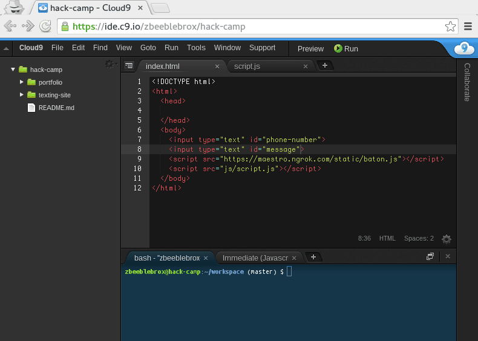
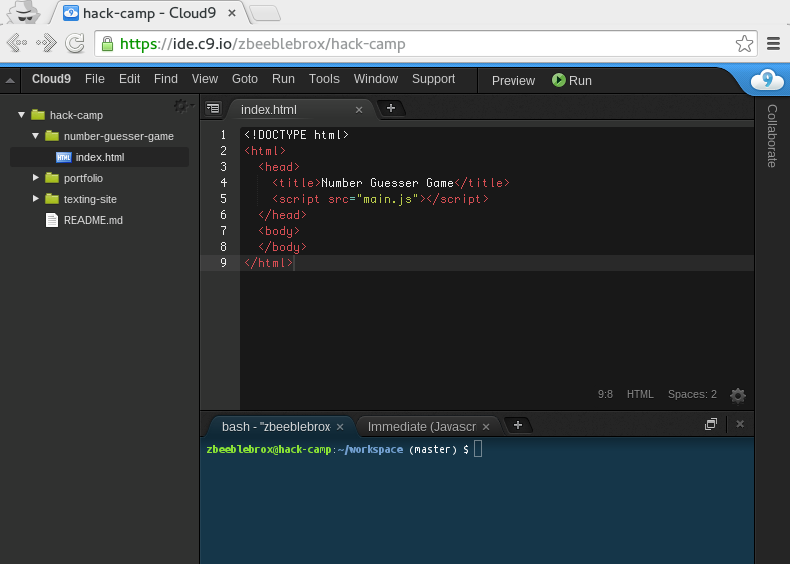

# Number guesser game

## Getting our environment set up

Let's go ahead and set up our environment for creating the number guessing game.

As we've done before, open up your `hack-camp` workspace and create a new folder
with the name `number-guesser-game`.



Now let's create a file called `index.html` to put our HTML into and open it.


Now let's go ahead and type (not copy and paste) the following website template
into `index.html`.

```html
<!DOCTYPE html>
<html>
  <head>
    <title>Number Guesser Game</title>
    <script src="main.js"></script>
  </head>
  <body>
  </body>
</html>
```
 
This sets up a basic webpage and tells it to include the JavaScript file
`main.js`. Your workspace should now look like the following:



But there's one issue with our website... `main.js` doesn't exist yet! Let's go
ahead and create it.


Great! Now we're all set up. The remainder of this guide will take place in
`main.js` (we won't be playing with the HTML).

## Let's make it

- We'll be breaking the game down into a few different parts:
  1. Starting the game
  2. Coming up with random number for the user to guess
  3. Taking a guess from the user and testing if it is right

### Starting the game

- The first step of the game is to run the game. Let's make a function for it:

  ```js
  function startGame() {
    console.log('game running!')
  }
  ```

### Coming up with a random number

Now that we can start our game, it needs to have a random number for the player
to guess.

- We want a random number. We can do this with `Math.random()`, which
  will return a random number from 0 to 1.

  ```js
  function getRandomNumber() {
    return Math.random();
  }
  ```

- Our `getRandomNumber()` function returns a number from 0 to 1. How can we get
  it to return a number from 0 to 20 using multiplication?

  ```js
  function getRandomNumber() {
    return Math.random() * 20;
  }
  ```

- Currently our `getRandomNumber()` function returns anything between 1 and 20,
  including hard-to-guess numbers like `3.1293129321` and `12.5921332`. We want
  to round these to `3` and `13`. We can round our numbers with `Math.round()`.

  ```js
  function getRandomNumber() {
    return Math.round(Math.random() * 20);
  }
  ```

- We want to access this random number from our game, so we'll assign it to a
  variable inside `startGame()`

  ```js
  function getRandomNumber() {
    return Math.round(Math.random() * 20);
  }

  function startGame() {
    console.log('game running!');
    var answer = getRandomNumber();
  }
  ```

### Take player's guess and test if it is right

Let's make a function that asks the user for a guess. It's input will be the
correct answer from the `startGame()` function. It will then ask the user for a
guess, and tell them if it was too low, too high, or correct. If the user's
guess was correct the function will not keep running, but if the guess was wrong
the function will keep running.

- Make a new function called
  `checkGuess()`
  - Make sure this is before the `startGame()` function

- The function will need to ask the user for a guess. We can do this with
  `prompt()`. Inside `checkGuess()` call the `prompt()` function with the
  argument `'Make a guess!'`.

  ```js
  function checkGuess(correctAnswer) {
    prompt('Make a guess!');
  }
  ```

- The `prompt()` function returns what the user types in. We'll use it later, so
  let's store it in a variable called `userGuess`.

  ```js
  function checkGuess(correctAnswer) {
    var userGuess = prompt('Make a guess!');
  }
  ```

- Now we need to check if the user's guess was correct. We can do this by
  checking if `userGuess == correctAnswer`.

  ```js
  function checkGuess(correctAnswer) {
    var userGuess = prompt('Make a guess!');
    if(userGuess == correctAnswer) {
      alert('You won!');
    }
  }
  ```

- Let's also check if the user's guess is too high (`userGuess >
  correctAnswer`), or too low (`userGuess < correctAnswer`).

  ```js
  function checkGuess(correctAnswer) {
    var userGuess = prompt('Make a guess!');
    if(userGuess == correctAnswer) {
      alert('You won!');
    } else if(userGuess > correctAnswer) {
      alert('Too high!');
    } else if(userGuess < correctAnswer) {
      alert('Too low!');
    }
  }
  ```

- Now we need to make sure the `checkGuess()` will keep asking the user or new
  guesses when their guess is wrong. Go to the `startGame()` function and add a
  `while` loop.

  ```js
  function startGame() {
    console.log('game running!');
    var answer = getRandomNumber(20);
    while(checkGuess(answer)) {
    }
  }
  ```

  - This will infinitly run `checkGuess(answer)` as long as `checkGuess(answer)`
    returns `true`. If it ever returns `false` the while loop will end.

- We want our `checkGuess()` function to return `true` whenever the user makes
  an incorrect guess so it will run again. We want our `checkGuess()` function
  to return `false` when the user guesses correctly, so the loop will end and we
  can tell the player they won.

  ```js
  function checkGuess(correctAnswer) {
    var userGuess = prompt('Make a guess!');
    if(userGuess == correctAnswer) {
      alert('You won!');
      return false; // we want to return false when the user guesses correctly
    } else if(userGuess > correctAnswer) {
      alert('Too high!');
      return true; // we want to return true when the user guesses wrong
    } else if(userGuess < correctAnswer) {
      alert('Too low!');
      return true; // we want to return true when the user guesses wrong
    }
  }
  ```

- Try the game!

### Adding a score

- Let's add a score to the game. We want to track the number of turns that
  occur, so let's make a new variable `turnCounter` to keep count.

  ```js
  
  function startGame() {
    console.log('game running!');
    var answer = getRandomNumber();
    var turnCounter = 1;
    while(checkGuess(answer)) {
    }
  }
  ```

- Let's increase the turnCounter everytime the user makes a guess. We can do
  this by adding 1 to turnCounter inside the while loop because everything
  inside the while loop will get run once everytime the loop runs.

  ```js
  function startGame() {
    console.log('game running!');
    var answer = getRandomNumber();
    var turnCounter = 1;
    while(checkGuess(answer)) {
      turnCounter = turnCounter + 1;
    }
  }
  ```

- Now we have to tell the user they won at the end. We can do this by calling an
  `alert()` function after our while loop in `startGame()` because we'll only
  run stuff after the loop when the user guesses correctly and
  `checkGuess(answer)` returns `false`.

  ```js
  function startGame() {
    console.log('game running!');
    var answer = getRandomNumber();
    var turnCounter = 1;
    while(checkGuess(answer)) {
      turnCounter = turnCounter + 1;
    }
    alert('You guessed the number in ' + turnCounter + ' turns.');
  }
  ```
