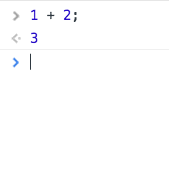
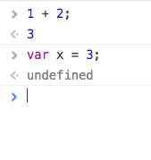
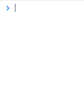
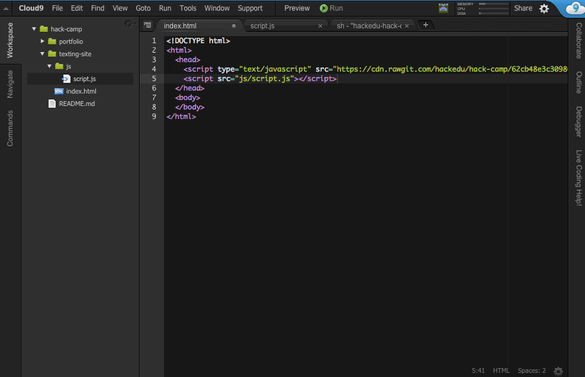
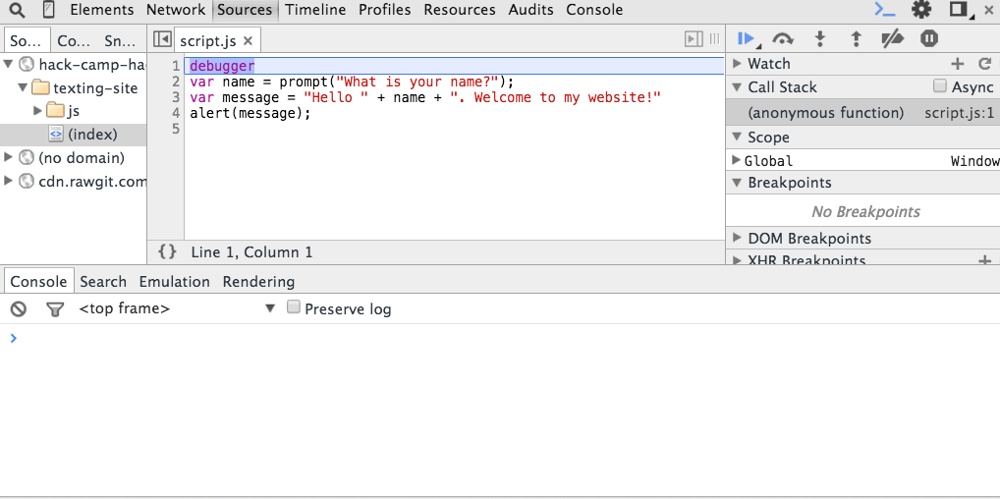
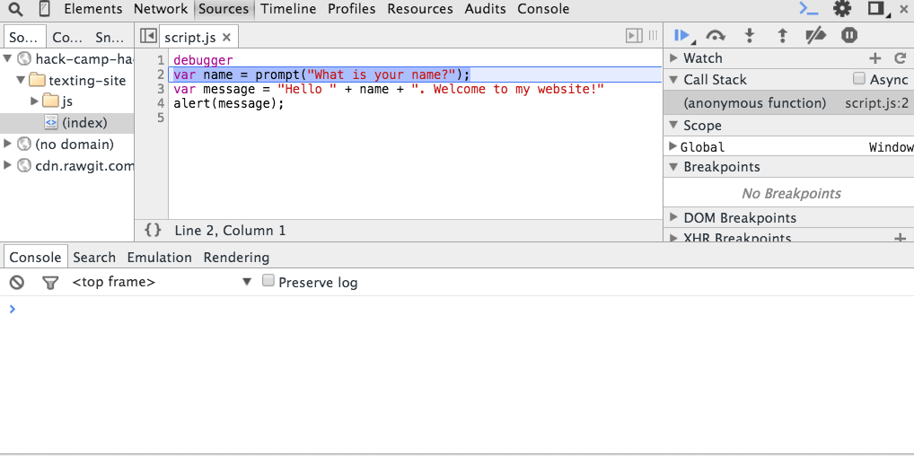
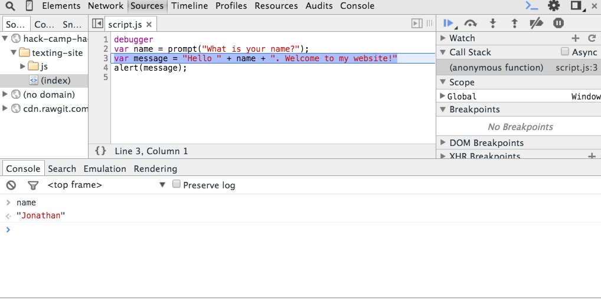
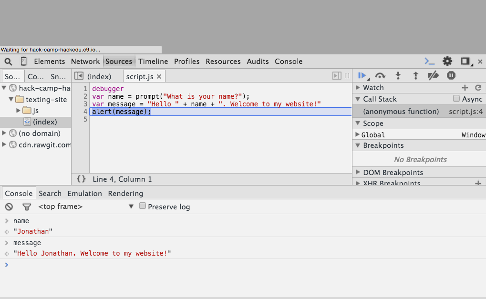

# TODO
- Google Voice

# STRUCTURE
- breadth first
- lengthier explanations at bottom of readme that specifically states that it is optional to read it for more clarification
- insert guiding questions

# Learning Javascript through Maestro

Our objective of this tutorial is to learn 
- the fundamentals of the programming language javascript
- the fundamentals of programing in general
- and how to send text messages and make phone calls with Maestro using javascript.

## Sections

TODO

## Demo

This is what you will be able to make with Maestro

- [Prank call](https://cdn.rawgit.com/hackedu/hack-camp/cb7a18c7e7bff6458d33be650de70186eb225f37/cohort_4/playbook/workshops/maestro/src/examples/prank/index.html)
- [Send a text](https://cdn.rawgit.com/hackedu/hack-camp/cb7a18c7e7bff6458d33be650de70186eb225f37/cohort_4/playbook/workshops/maestro/src/examples/send_sms/index.html)
- [Send a photo](https://cdn.rawgit.com/hackedu/hack-camp/cb7a18c7e7bff6458d33be650de70186eb225f37/cohort_4/playbook/workshops/maestro/src/examples/feeling/index.html)
- [Send a song](https://cdn.rawgit.com/hackedu/hack-camp/cb7a18c7e7bff6458d33be650de70186eb225f37/cohort_4/playbook/workshops/maestro/src/examples/song/index.html)

## Questions you should be able to answer after this tutorial

*Just skim this list, we'll ask the questions after each section.*

**High level questions**

- What is JavaScript? Why do we use it?
- How do you add JavaScript to your html page?

**Questions about the fundamentals of programming.**

- What does it mean when I say "code executes in order"?
- What is a string in JavaScript?
- What is a function?
- What is a function's input?
- What is a function's output?
- What is a programming construct I can use to remember things in programming?
- How do I remember a function's output?
- How do I use a variable as a placeholder?
- What are some use cases of variables in programming?
- What programming construct

**Questions specifically about javascript in the web browser**

- In JavaScript, how do you make an alert box show up on the screen?
- In JavaScript, how do you ask a user for an input?

**Questions about how to use the Maestro library**

- How do I send a text message with Maestro?
- How do I make a phone call through Maestro?
- How do I send a multimedia message through Maestro?
- How do I play an mp3 file through Maestro?

## What is JavaScript

JavaScript is the programming language that runs in every web browser.

HTML & CSS are responsible for the data, look and the feel of the website.

For any interactivity on a page (things popping up, things that are changing on the page), JavaScript is responsible for it.

For example on Facebook.com, notice my interaction with the pages before and after disabling javascript.


## Running your code in the console

For the rest of this tutorial, please use Google Chrome.

If you don't have it already, download it.

Then open Google Chrome.

Once Chrome is opened, open the developer tools by pressing
- on a mac: `Cmd` + `Opt` + `J`
- on a PC: `Ctrl` + `Shift` `J`

This is a place where we can run Javascript code.


## Fundamental Concepts in Javascript

### How to go about this section

If you don't understand anything you type
- ask your neighbors to see if they get it
- if not, ask a facilitator.

### you can add numbers together in javascript:

> 

- type `1 + 2;`
- press `enter` to submit it
- notice that "it gives you back" `3`
- what this "gives you back" can be referred to as the output of `1 + 2;`

```
A Note On Comments

note that anything after a `//` is what is called a comment
anything that is 'commented' is ignored by the computer

therefore

1 + 2; // -> 3
^^^^^^ this is looked at by the computer

1 + 2; // -> 3
       ^^^^^^^ this is ignored by the computer

// this is a comment
^^^^^^^^^^^^^^^^^^^^ everything is ignored by the computer
```

```
A Note on Semicolons

1 + 2;
     ^ this must be at the end of almost every line in javascript;

sometimes the code may still work without it, 
sometimes however it doesn't. Best to just add it.
```

```
Challenge!  
Time        __
           / _)   
    .-^^^-/ /
 __/       /
<__.|_|-|_|

Try adding two other numbers together.
```

### You can use variables to hold values of numbers

> 

- I type `var x = 3;`
- press `enter`
- this is equivalent of saying "I want to set the variable x to be equal to 3"

### I can ask the computer what the value of `x` is

If I want to find out the value of `x`, I can just type it in the console
and press `enter`

> 

### A note about variables
In math class you would have written this is "x = 3"

In javascript, you need to add:
    
- "var" in front of variables
- a ";" at the end of every line

I also notice that the output is `undefined`. 

Note, this doesn't mean mean that the output of `var x = 3;` is not 
  defined. This is just outputted anytime you assign a variable to
  something.

```
Challenge!  
Time        __
           / _)   
    .-^^^-/ /
 __/       /
<__.|_|-|_|

Can you set the variable `y` to be equal to 2 and then check it's value?
```

Solution:

- Type this into the console `var y = 4;` and press `enter`
- type `y` again to get the value of `y`

### Manipulating variables

Now that we know that `x` is `3` and `y` is `4`, we can do

> 

```
Try It!  
            __
           / _)   
    .-^^^-/ /
 __/       /
<__.|_|-|_|

Try adding a number to a variable, like `y + 1`
```

### I can use multiWordVariables

However variables cannot have spaces in them.

> 

### JavaScript also lets you play with words

If I just wrote `numberOfChickens` without defining it:

> 

You will get the error:

> 

Which just means "you have never defined the variable `numberOfChickens`"

I would also get an error if I wrote `Hello my name is Jonathan`

> 

So how do i actually write words? You have to put quotes around it, like this:

> 

And you can write longer phrases too

> 

```
Try it!
            __
           / _)   
    .-^^^-/ /
 __/       /
<__.|_|-|_|

Try making a couple Strings of your own in the console.
```

**Important Vocabulary**

`"Hello"` and `"Hello! welcome to wonderland!"` are Strings.

A `String` is *anything* inside of double quotes.

Therefore `"2"` is a `String` because it is inside double quotes.

### Adding multiple Strings together

I can add strings like this:


Oops, I should add a space:


I can add multiple String together:


```
Try it!
            __
           / _)   
    .-^^^-/ /
 __/       /
<__.|_|-|_|

Try adding multiple Strings together in the console.
```

### I can assign Strings to variables


```
Try it!
            __
           / _)   
    .-^^^-/ /
 __/       /
<__.|_|-|_|

Try to assign a string to a variable and add another String to it.
```

### I can add two variables together that are both Strings


```
Try it!
            __
           / _)   
    .-^^^-/ /
 __/       /
<__.|_|-|_|

Try assigning two variables as strings and adding them together!
```

### I can assign a variable to the output to the sum of both Strings


```
Try it!
            __
           / _)   
    .-^^^-/ /
 __/       /
<__.|_|-|_|

Try assigning a variable to the sum of two variables.
```

### The prompt function

This line of code below is a function

```
prompt("What is your name?");
```


Every function performs an action and has an output.

In this case, this function, `prompt`, performed the **action** of popping up a question on the screen based on the **input**. Then based on whatever the user types it becomes the **output** of the function.

There are 3 components to a function

- inputs
- actions
- outputs

Some terminology
```
prompt("What is your name?");
^^^^^^ this is the name of the function

prompt("What is your name?");
      ^                    ^
      to run a function, the name of a function is followed by parathesis
      anything inside of the parenthesis is an input

prompt("What is your name?");
       ^^^^^^^^^^^^^^^^^^^^ this is the input

       in this case, this function had 1 input
       and that input was the string "What is your name?"

The ACTION performed is the box actually popping up on the screen

And the OUTPUT of the function, was the String "Jonathan"
```

### I can assign a variable to the output of a function


```
Try It!
            __
           / _)   
    .-^^^-/ /
 __/       /
<__.|_|-|_|

Try assigning a variable to an output of your own prompt function.
```

### The alert function


The `alert` function is like the `prompt` function except

- it has `0` inputs
- it's action is similar in that it makes a popup box, but the popup doesn't have an area where the user can type in.
- it's output is always `undefined`

## Writing code in a proper editor

### Creating a new folder
- Open your **EXISTING** `hack-camp` Cloud9 workspace and create a new folder called
  `texting-site` inside your already existing `hack-camp` folder
  - This is similar to how you set up your `portfolio` folder for the previous
    workshop

### Creating index.html
- Inside the folder create a new file called `index.html` and open it
- Go ahead and type out a website template to the file

  ```html
  <!DOCTYPE html>
  <html>
    <head>
    </head>
    <body>
    </body>
  </html>
  ```

### Adding the Maestro script
- At the `<head>` tags, let's go ahead and create a `<script>` tag with an
  attribute `src` set to `https://cdn.rawgit.com/hackedu/hack-camp/62cb48e3c30986350e71fd3153501883bee532c1/cohort_4/playbook/workshops/maestro/src/lib/maestro.js`

  ```html
  <!DOCTYPE html>
  <html>
    <head>
      <script type="text/javascript" src="https://cdn.rawgit.com/hackedu/hack-camp/62cb48e3c30986350e71fd3153501883bee532c1/cohort_4/playbook/workshops/maestro/src/lib/maestro.js"></script>
    </head>
    <body>
    </body>
  </html
  ```

  - `<script>` tags are how we tell the browser to include JavaScript in the
  page. Where HTML and CSS make up what is on a webpage and how it's shown,
  JavaScript is the programming language that makes webpages functional. With
  JavaScript we can:
    - Make websites respond to user interactions
    - Building apps and games (e.g.
      [2048](http://gabrielecirulli.github.io/2048/))
    - Access and modify information on the internet (e.g. finding out the
      weather, sending a text message)
  - `https://maestro.ngrok.com/static/baton.js` is a file with a bunch of
    JavaScript commands in it we've already created for you

### Adding our own JavaScript code

- Now let's create a file to store our JavaScript code in. Go ahead and create a
  directory, `js`, and then create a file, `script.js`, inside the `js`
  directory.
- Now let's tell the browser to include this JavaScript file as well. Below the
  `<script>` tag add a second `<script>` tag in your `<head>` with the attribute
  `src` set to `js/script.js`

  ```html
  <!DOCTYPE html>
  <html>
    <head>
      <script type="text/javascript" src="https://cdn.rawgit.com/hackedu/hack-camp/62cb48e3c30986350e71fd3153501883bee532c1/cohort_4/playbook/workshops/maestro/src/lib/maestro.js"></script>
      <script src="js/script.js"></script>
    </head>
    <body>
    </body>
  </html>
  ```

### Disabling Autosave

You will go crazy today with popups unless you disable "Auto-Save"



### Writing our code in script.js

Let's type the following code in the `script.js` file

```
debugger
var name = prompt("What is your name?");
var message = "Hello " + name + ". Welcome to my website!"
alert(message);
```

- Go ahead and click `Preview Running Application` to run it.
- Click the arrow to move the window to an external tab
- Open up the console
- **IMPORTANT, MAKE SURE YOU REFRESH THE PAGE.**
  - Note, the only way to it stop at the debugger is if you refresh the page.
- you should see your code paused here
  > 
    
- click on the `>_` symbol to open up the console on this screen
  > 

### Understanding our code through debugging

We can walk through line by line how our code.

The blue line of code highlights the line of code that will be run next.

#### Right now, the code is paused on line 1. I run it and it advances the blue cursor to line 2.

Note: only seeing a blank page?

- **MAKE SURE YOU REFRESH THE PAGE.**
  - Note, the only way to it stop at the debugger is if you refresh the page.


> 

#### Since the blue cursor is on line 2, when I click the next button, , it runs line 2 which in this case  makes a prompt. I type in Jonathan and it outputs that to the variable `name`. So when I ask the computer at the end what `name` is equal to, it tells me `Jonathan`.

> 

Now when I click next, it runs the line highlighted in blue (line 3). This sets the variable `message` to the sum of all of those strings. In this case `message` is now equal to the String`"Hello Jonathan. Welcome to my website!"`

> 

Finally on the last line, I `alert` the `message` variable, which is equal to `""Hello Jonathan. Welcome to my website!"`

> 

Code always executes in order like this.

You can always put a debugger statement at the top to walk through this process to understand your code line by line

## Instead of alerting we are going to send a text message

In order to be able to use Maestro to be able to send text messages and make phone calls, we need to do some more configuration.

in our `script.js`, let's delete everything  we have in it (we're going to add it somewhere else) and add just this line of code

```js
var maestro = new Maestro("js/maestro_code.js");
```

This line of code tells Maestro to run the javascript file `js/maestro_code.js`. For all intents and purposes, Maestro code can only run in the files that it is told to run.

Now we need to actually make this file:

- create a new file in the `js` folder called `maestro_code.js`
- now let's make our first Maestro call. Look at the below code and replace the phone number with your own phone number.

```
maestro.Twilio.callAndSay("415-555-555", "Hello, good morning Jonathan!");
```

This is how everything should look right now:

`index.html`
```html
<!DOCTYPE html>
<html>
  <head>
    <script type="text/javascript" src="https://cdn.rawgit.com/hackedu/hack-camp/62cb48e3c30986350e71fd3153501883bee532c1/cohort_4/playbook/workshops/maestro/src/lib/maestro.js"></script>
    <script src="js/script.js"></script>
  </head>
  <body>
  </body>
</html>
```

`js/script.js`
```js
var maestro = new Maestro("js/maestro_code.js");
```

`js/maestro_code.js`
```js
maestro.Twilio.callAndSay("415-555-555", "Hello, good morning Jonathan!");
// DON'T FORGET TO CHANGE YOUR PHONE NUMBER
```

If you run this code, it should call your phone and say "Hello, good morning Jonathan"!

**Understanding the Code**

Let's understand the code a little bit.

```js
maestro.Twilio.callAndSay("415-555-555", "Hello, good morning Jonathan!");
// the entire above line is calling a funtion

maestro.Twilio.callAndSay("415-555-555", "Hello, good morning Jonathan!");
// ^^^^^^^^^^^^^^^^^^^^^^ is the name of the function

maestro.Twilio.callAndSay("415-555-555", "Hello, good morning Jonathan!");
// it has two inputs     1^^^^^^^^^^^^^ 2^^^^^^^^^^^^^^^^^^^^^^^^^^^^^^^

maestro.Twilio.callAndSay("415-555-555", "Hello, good morning Jonathan!");
// the action of this function is to call the number specified in the 1st input
// with the text in the 2nd input

// Note that the output to this function is undefined, ask a facilitator about this if you have questions
```

## Combining with the previous code

`maestro_code.js`
```js
var name = prompt("What is your name?");
var message = "Hello " + name + ". Welcome to my website!"
maestro.Twilio.callAndSay("415-555-555", message);
```

## Done!

Yay we did it!


## Here are a bunch of other programs that you can put into `maestro_code.js`

Feel free to tinker around with these examples.

- try to get them to work
- see if you can understand how they work perhaps by `debugger` through it
- try modifying the programs to do something else that you want.

Definitely try using `debugger` to explore how they work.

### Sends a Text Message

```js
var phone = prompt("Choose a friend to send a text message to. What is their phone number?");
var message = prompt("What message do you want to send them?");
maestro.Twilio.sendSms(phone, message);
alert("Your text message has been sent to " + phone);
```

### Makes a Prank Call

```js
var phone = prompt("Choose a friend to prank call. What is their phone number?");
var message = "Hi this is Sam from 31 Flavors, if you can name 31 Flavors in 31 seconds you can win 31 thousand dollars, ready go!!";
maestro.Twilio.callAndSay(phone, message);
alert(phone + " is being prank called...");
```

### Sends Your Friend a Photo Based On How You're Feeling

Note, this uses a concept that you're not familiar with yet but I think you can figure it out especially if you google the words you're not familiar with

```js
var phone = prompt("What is your friend's phone number?");
var feeling = prompt("How does your friend make you feel? Possible feelings include happy, special, and safe.");

if (feeling === "happy") {
  maestro.Twilio.sendMms(phone, "http://cdn.meme.am/instances/61188073.jpg");
}
else if (feeling === "special") {
  maestro.Twilio.sendMms(phone, "http://www.mememaker.net/static/images/memes/4138705.jpg");
}
else if (feeling === "safe") {
  maestro.Twilio.sendMms(phone, "http://ih0.redbubble.net/image.4149579.6742/flat,800x800,070,f.jpg");
}
else {
  maestro.Twilio.sendMms(phone, "http://4.bp.blogspot.com/-7zdzQsTt99k/U0c6xmLXOwI/AAAAAAAAAIQ/-2M0tNNNHIY/s1600/you+are+awesome.jpg")
}

alert("Great! We just sent an appropriate photo to " + phone);
```

### Sends your friend a song based on what they're up to

```js
var phone = prompt("Think of a friend that could use an music energy boost? What is their phone number?");
var activity = prompt("What kind of activity do they need an energy boost for? Types of activities include party, study, and love.");

maestro.Twilio.sendSms(phone, "I thought you could use an energy boost...");

if (activity === "party") {
  maestro.Twilio.callAndPlay(phone, "http://mp3light.net/assets/songs/20000-20999/20724-tik-tok-kesha--1411570590.mp3");
}
else if (activity === "study") {
  maestro.Twilio.callAndPlay(phone, "http://a.tumblr.com/tumblr_lie8ewfdbO1qzbwpvo1.mp3");
}
else if (activity === "love") {
  maestro.Twilio.callAndPlay(phone, "http://prv.mp3caprice.com/preview/111/816/1.mp3");
}
else {
  maestro.Twilio.callAndPlay(phone, "http://mc01.userfiles.me/m/0/1395096936/38743662/64/2dc38b310bdac571fb2400696bd08265/Pharrell_Williams-Happy_-spaces.ru.mp3");
}

alert("Great! We'll give " + phone + " a ring!");
```

#### Finding mp3's on the internet.

Note: I found these MP3s on [MP3skull](http://mp3skull.com/) To find an mp3 that will work, you want the pages that display a raw mp3 file (i.e. a page that has no HTML on the page, just the mp3 file). 

**Important note to avoid frustration**
And when you've found these mp3 files, some of them will not be compatible with Twilio for some reason that I do not know yet. You'll have to test out which ones work and which ones don't.

### For those who are more advanced, checkout

```js
maestro.Twilio.recieveSms(function(reply){
  console.log(reply.From); //prints the number that sent a message to twilio-number
});
```

```js
maestro.Giphy.findFirst("Search text", function(response){
  console.log(response.url); //will print a url to the first result
});
```