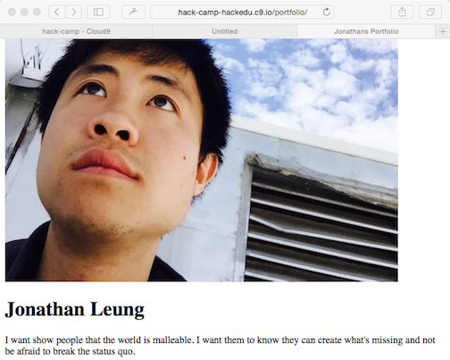
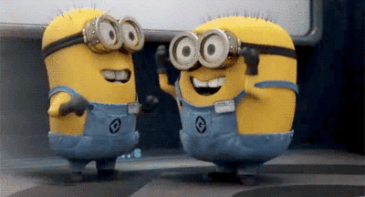

# TODO


# Todo

- change size of  tag
- oh no, all of them are changed, i want to change different ones
- let me add a class for the profile image
- can you add a class for the logos

- let me style directly on the h1s
- you style directly on the paragraph
- well class is actually preferrable for the same as the image
- can you change it to a class for the description

- now I want to center everything
- lets start with the name
- you center the paragraph

- it would be way easier to just center the body
- yay, everything is centered

- spacing

- constraining width


Later discussion
- inline vs block
- how to center each one


- font color off of body
- text-align center off of body


# Outline
MVP 2
- add scoping
- move the social media icons out of the flow


- Challenge
  - Title
  - Desired vs Current
  - Looking at the Outline For Where We Are
  - Asking for help
  - Dino Challenge
- Solution
  - Title
  - Desired Vs Current
  - Explanation for what needs to be done from a 1st person perspective
  - Forming the Google Query
  - Running the Google Query
  - The Creation of Code Line
    - Validating the code line
  - Adding the Code Line (Solution)
  - Seein the result
  - Vocabulary
  - Next

- css display

http://davidwalsh.name/center-website


# TODO
- Link to previous and next pages at the top of the markdown page
- Make the Googling examples stronger (perhaps have andrea do them)
- Have a list of questions at the 
    - End of the entire tutorial
    - End of each section that they should be able to answer
- Include the outline at the bottom of each markdown file
- Include a "what we learned section that has like"
  - to add a heading, do X
  - to do a Google, do this
  - a nice quick reference
- make gif of disabling CSS, JS and such
- take each page snippet and put it in an actual file and link each code snippet to a live example
- change up celebration gifs with stward animate 
- talk about the high level steps of
  - doing all the HTML, then the CSS, and then the others


## This might be good content for the initial slides or perhaps later

  - Let's see what our website looks like so far.

    

  - We can also open the website in its own tab.

    
- What have we done so far?
  - So what was that code we typed? Spoiler alert: almost every website on the
    internet is secretly written in a language called **HyperText Markup
    Language**, otherwise known as "HTML". So why don't you see code
    everywhere? Well, your browser reads HTML for you and just shows you the
    pretty version. It is sheltering you!
  - We'll get our hands a bit dirtier with the basics of HTML. We'll talk a
    little about formatting, links, and images so you can make a simple, but
    ugly, webpage.
  - If you want to make it pretty, we'll also do a quick dive into Cascading
    Syle Sheet (CSS), which many websites secretly use to make themselves
    pretty.
  - The basic building blocks of HTML are _HTML elements_. HTML elements are
    denoted by angled brackets. These are called **tags**. `<html>`, `<head>`,
    `<body>`, `<title>`, and `<h1>` are all tags.
  - All of the tags listed above are referred to as start tags - and if you
    start something, you need to end it. The end tag is exactly the same as
    the start tag with a cute forward slash (`/`) after the `<`. Consequently
    the end tag for `<html>` is `</html>`. The end tag for `<head>` is
    `</head>`, and so on.
  - HTML documents contain two important parts, denoted by tags:
    1. **head** - contains information about the document that is _not
       displayed on the screen_.
    2. **body** - contains everything that id displayed on the webpage.
  - Don't worry if you don't understand everything so far! You'll get a better
    understanding of these concepts as you write more code. As always, the
    most important thing is to ask a lot of questions!
    - _Warning_: some of the wording in this section was taken from Codecademy -
      remember to change this.

```html
<!-- PORTFOLIO -->

  <!-- IMAGE SECTION -->
    
  
  <!-- INFORMATION SECTION -->
    <h1>Jonathan Leung</h1>
    <p>I want show people that the world is malleable. 
       I want them to know they can create what's missing
       and not be afraid to break the status quo.</p> 
    
  <!-- SOCIAL MEDIA SECTION -->
    <a href="https://twitter.com/jonathanjleung">
      
    </a>
    <a href="https://facebook.com/jonleung137">
      
    </a>
    <a href="https://github.com/jonleung">
      
    </a>
```

```html
<body>
<!-- PORTFOLIO -->

  <!-- IMAGE SECTION -->
    
  
  <!-- INFORMATION SECTION -->
    <h1>Jonathan Leung</h1>
    <p>I want show people that the world is malleable. 
       I want them to know they can create what's missing
       and not be afraid to break the status quo.</p> 
    
  <!-- SOCIAL MEDIA SECTION -->
    <a href="https://twitter.com/jonathanjleung">
      
    </a>
    <a href="https://facebook.com/jonleung137">
      
    </a>
    <a href="https://github.com/jonleung">
      
    </a>
</body>
```

```html
<head>
    
</head>
<body>
<!-- PORTFOLIO -->

  <!-- IMAGE SECTION -->
    
  
  <!-- INFORMATION SECTION -->
    <h1>Jonathan Leung</h1>
    <p>I want show people that the world is malleable. 
       I want them to know they can create what's missing
       and not be afraid to break the status quo.</p> 
    
  <!-- SOCIAL MEDIA SECTION -->
    <a href="https://twitter.com/jonathanjleung">
      
    </a>
    <a href="https://facebook.com/jonleung137">
      
    </a>
    <a href="https://github.com/jonleung">
      
    </a>
</body>
```

```html
<head>
    <title>Jonathan Leung</title>
</head>
<body>
<!-- PORTFOLIO -->

  <!-- IMAGE SECTION -->
    
  
  <!-- INFORMATION SECTION -->
    <h1>Jonathan Leung</h1>
    <p>I want show people that the world is malleable. 
       I want them to know they can create what's missing
       and not be afraid to break the status quo.</p> 
    
  <!-- SOCIAL MEDIA SECTION -->
    <a href="https://twitter.com/jonathanjleung">
      
    </a>
    <a href="https://facebook.com/jonleung137">
      
    </a>
    <a href="https://github.com/jonleung">
      
    </a>
</body>
```

```html
<head>
    <title>Jonathan Leung</title>
    <link rel="stylesheet" type="text/css" href="main.css">
</head>
<body>
<!-- PORTFOLIO -->

  <!-- IMAGE SECTION -->
    
  
  <!-- INFORMATION SECTION -->
    <h1>Jonathan Leung</h1>
    <p>I want show people that the world is malleable. 
       I want them to know they can create what's missing
       and not be afraid to break the status quo.</p> 
    
  <!-- SOCIAL MEDIA SECTION -->
    <a href="https://twitter.com/jonathanjleung">
      
    </a>
    <a href="https://facebook.com/jonleung137">
      
    </a>
    <a href="https://github.com/jonleung">
      
    </a>
</body>
```

## Font Color
- initially do red
- then do gray

```css
body {
    color: rgb(68, 68, 68);
}
```


## Centering
- don't use the center tag
```css
body {
    color: rgb(68, 68, 68);
    text-align: center;
}
```


## Profile Picture - I Do

```html

```

```css
.profile-picture {
    width: 200px;
}
```

## Social Media Icons - You Do

```html
<a href="https://twitter.com/jonathanjleung">
  
</a>
<a href="https://facebook.com/jonleung137">
  
</a>
<a href="https://github.com/jonleung">
  
</a>
```

```css
.social-icon {
    width: 40px;
}
```

## Fonts
- I add Arial to .name
- You add Arial to .description
- also do font-size here

## Google Web Fonts
- I add Source Sans Pro to .name
    - ordering of CSS?
    - expect http error (console lesson)
- You add Raleway to .description
    - font weights

```html
<h1 class="name">Jonathan Leung</h1>
<p class="description">I want show people that the world is malleable. 
   I want them to know they can create what's missing
   and not be afraid to break the status quo.</p> 
```

```css
.name {
  font-family: 'Source Sans Pro', sans-serif;
}

.description {
  font-family: 'Raleway', sans-serif;
}
```

```css
.name {
  font-family: 'Source Sans Pro', sans-serif;
  font-weight: 700;
}

.description {
  font-family: 'Raleway', sans-serif;
  font-weight: 300;
}
```


## Border Radius

```css
.profile-picture {
    width: 200px;
    border-radius: 100px;
}
```

## Constraining Width

- Show screenshot of constraining the width with the sketch
- Then show the inspect element
- Now we constrain the width
- And now we center it

```html
<body>
<!-- PORTFOLIO -->
<div class="container">
    

  <!-- IMAGE SECTION -->
    
  
  <!-- INFORMATION SECTION -->
    <h1>Jonathan Leung</h1>
    <p>I want show people that the world is malleable. 
       I want them to know they can create what's missing
       and not be afraid to break the status quo.</p> 
    
  <!-- SOCIAL MEDIA SECTION -->
    <a href="https://twitter.com/jonathanjleung">
      
    </a>
    <a href="https://facebook.com/jonleung137">
      
    </a>
    <a href="https://github.com/jonleung">
      
    </a>
</body>
```

- Creating divs for every secion


====

## Quick Challenge

Can you add the image of the Facebook logo to the bottom of the page?

Here is the link to the image:

```
http://i.imgur.com/hqhKh8l.png
```

## Quick Solution

```html

```

```html
<!DOCTYPE html>
<html>
  <head>
    <title>Jonathans Portfolio</title>
    <link rel="stylesheet" href="main.css" type="text/css" />
  </head>
  <body>
    <!-- PORTFOLIO -->
    
      <!-- IMAGE SECTION -->
        
    
      <!-- INFORMATION SECTION -->
        <h1>Jonathan Leung</h1>
        <p>I want show people that the world is malleable. I want them to know 
        they can create what's missing and not be afraid to break the status quo.</p>
        
      <!-- SOCIAL MEDIA SECTION -->
        <!--==================BEGIN_CHANGES==================-->
        
        <!--===================END_CHANGES===================-->
        - link to Twitter (https://twitter.com/jonathanjleung)
        - link to Github (https://github.com/jonleung)
  </body>
</html>
```

## Seeing the result

- I make sure that I have clicked on `Preview Running Application`
- I refresh the preview page to see:

> 



## For Now, Let's Get Rid


## Quick Cleanup


## Next
We've added EVERYTHING that we need in the HTML for Part 1. Let's take your website and put it on the internet!

[Put our code permanently on the live internet!](github.md)


##### Putting your code on the internet
1. [Putting your code on the internet](github.md)

##### Styling your website

1. Adding a title
    1. _TODO: Create and link title_challenge.md_
    1. _TODO: Create and link title_solution.md_
1. [Adding styles to your website](add_css.md)
1. Setting font color
1. Centering everything
1. Changing the size of the images
1. Changing the fonts
1. Using Google Web Fonts
1. Creating the sections and adding spacing


1. adding things to the head
    1. title tag

    1. add head > link
    1. this is the first time that we have something we don't want to display on the page, that's why we added to head not body
1. adding & styling body
    1. make all the text the same color
    1. center everything
1. non spacing related things
    1. I do profile picture size
        1. you change social media icon size
    1. I change name
        1. font1.size
        1. font1.family
        1. font1.weight
        1. you change description
            1. font1.size
            1. font1.family
            1. font1.weight
    1. I change google web font
        1. you change google web font
1. then do spacing related things
    1. use the chrome inspector for all of the below
    1. I show constraining width somewhere else
        1. you show constraining width with container
            1. two elements
    1. I show centering a container
        1. you show centering container
    1. creating divs for each section
        1. draw diagram
    1. I show you margin1.top, left, right


